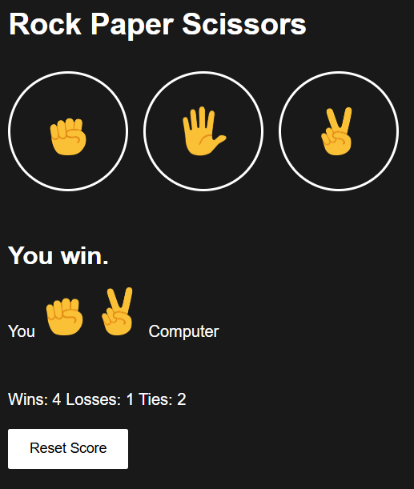

# Rock Paper Scissors JS

This is a simple Rock Paper Scissors game built while learning the basics of HTML, CSS, and JavaScript. The project demonstrates fundamental web development concepts and interactive UI features.

## Features
- Play Rock, Paper, Scissors against the computer
- Score tracking (Wins, Losses, Ties)
- Reset score button
- Simple, modern UI with emoji graphics
- Score persists using localStorage

## How to Run
1. Download or clone this repository.
2. Open `rps.html` in your web browser.

## Screenshot
See above for a preview of the game UI.

## Purpose
This project was created as a learning exercise to practice basic web development skills.

---
Feel free to use or modify this project for your own learning!
